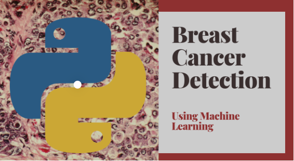

# Vaibhavi Thakkar
## Sr.Software Engineer and Business Analyst
### [LinkedIn Profile]([www.linkedin.com/in/vaibhavi-khakhkhar-thakkar-0b54005a])

Having 6+ years of experience to build & break rich applications using iPhone technology and frameworks. Cohesive team worker, strong analytical, problem solving and interpersonal skills. Good Experience in Software Engineering Concepts including Designing, Programming, Implementation and Testing. Having good knowledge of agile methodology. Ability to conceptualize, document, and communicate project ideas and plans. Enthusiastic and quick to learn new applications and tools and willing to take individual responsibilities.

## Education
* Bachelors in Computer Engineering, Govt.Engineering College,India (2009 - 2013)
* Post Graduation in Artifical Intelligence,Durham College,Canada (2021 - 2022)
* Post Graduation in Data Analytics in Business Management,Durham College,Canada (2022- 2023)

## Skill Set:
* Programming Language: Objective C, Swift, Python
* Framework/Technologies: iOS Touch framework, Mapkit, Location, Bluetooth, Audio recorder, Firebase
* Databases: SQLite, Core Database
* Tools: Jira, Basecamp, Airtable, Scrum, XCode, SmartSVN, Gitlab, Bitbucket, GitHub,Tableau
* Programming Concepts: OOPS, MVC, Distributed Caching
* Visualization Tool : Tableau,PowerBI

## Experience: Senior Software Engineer (Mobile Application Developer)

## <ins>  Cygnet Infotech Pvt Ltd.
#### Sr. Software Engineer – App Developer (September 2015 to March 2020)
Responsible for analysis, impact, development and end to end delivery. Impact of requirement and feature on new or existing apps. Managed & Improved Project Architectures. Involved in analysis, coding, and testing. Planning for deployment and delivering features to production. Must promote and work well in a team environment. Design app from scratch. Maintain the live app and bug fixes. Implement functionality as described. Testing on development environment and production environment.

## <ins> Amphee Webtech Pvt Ltd
#### Software Developer (January 2015 to September 2015)
Responsible for design apps from scratch.Maintain the live app and bug fixes. Implement functionality as described.Design app from scratch.Testing on development environment and production environment.Necessary certification creation for deploying app.Releasing app to Appstore

## <ins> Appmax Technologies
#### Jr. Software Developer (August 2013 to December 2014)
Responsible for design apps from scratch.Necessary certification creation for deploying app . Maintain the live app and bug fixes. Implement functionality as described.Design app from scratch.Testing on development environment and production environment.Releasing app to Appstore

### Live Application developed and deployed to Appstore
### [M1-Ordering](https://apps.apple.com/us/app/grocery-order-cygneto-order/id1217775259)
### [Cygneto Field Sales](https://apps.apple.com/us/app/cygneto-field-sales/id1174884191)
### [Blocks In Line](https://apps.apple.com/ie/app/blocks-in-line/id809376108#?platform=iphone)
### [Body Fitness App](https://apps.apple.com/ie/app/blocks-in-line/id809376108#?platform=iphone)

## Experience: As Student (Machine Learning Developer)

## [Project 1: GadgetBot]([https://github.com/TVaibhavi/GadgetChatbot])

GadgetBot provides innovative and automated system that helps customer to buy gadgets at best deal. A web-based software powered with AI that allows customer to browse the gadgets and bargain with the chatbot for the flexible price.

* **Technologies Used:** 
Python
HTML/CSS
Javascript
Django
Rasa
SQLite

## [Project 2: ML - Breast Cancer Detection](https://github.com/TVaibhavi/Breast_Cancer_Lab1)

This project makes use of ***Machine Learning*** of Breast Cancer detection coupled with ***technical analysis*** in the detection of desease.
* **Python libraries used:** Python IDE
* **Input:** Provide data with manadatory field 
* **Output:** Detects whether patient has cancer or not based on ML analysis prediction
